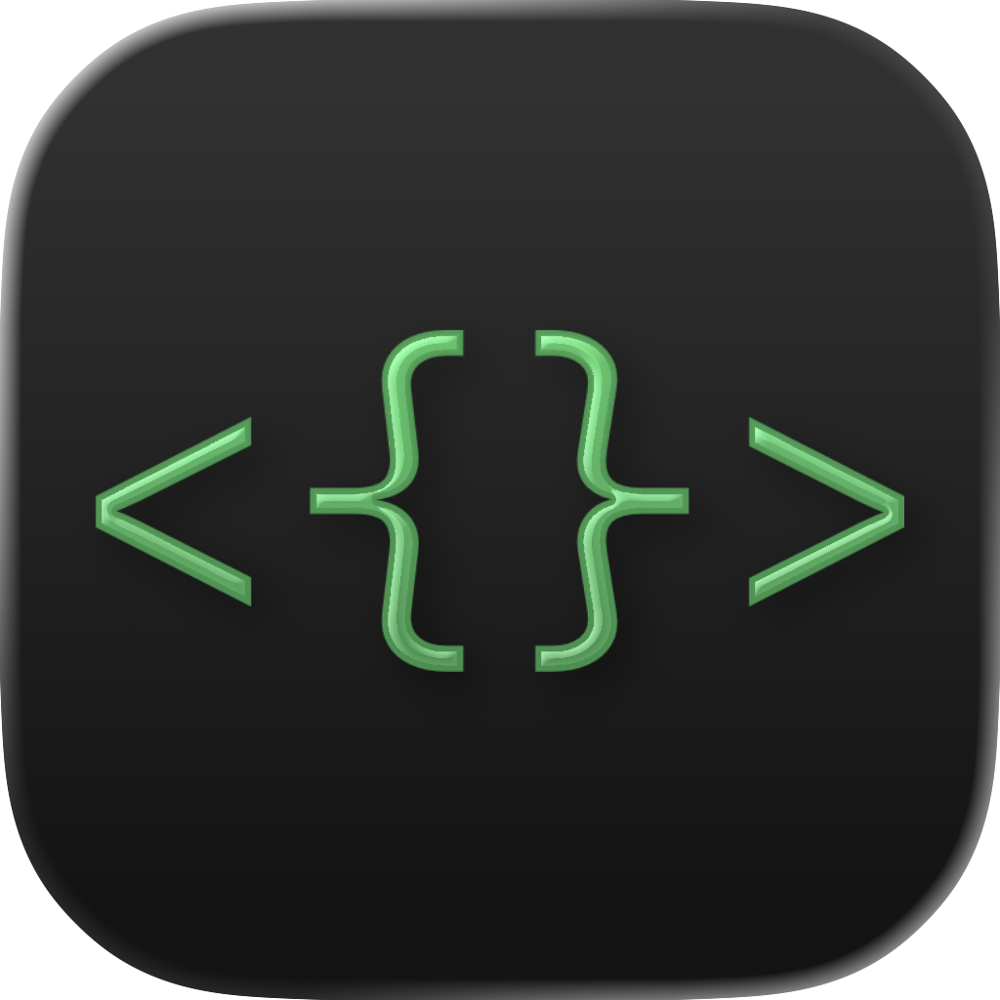
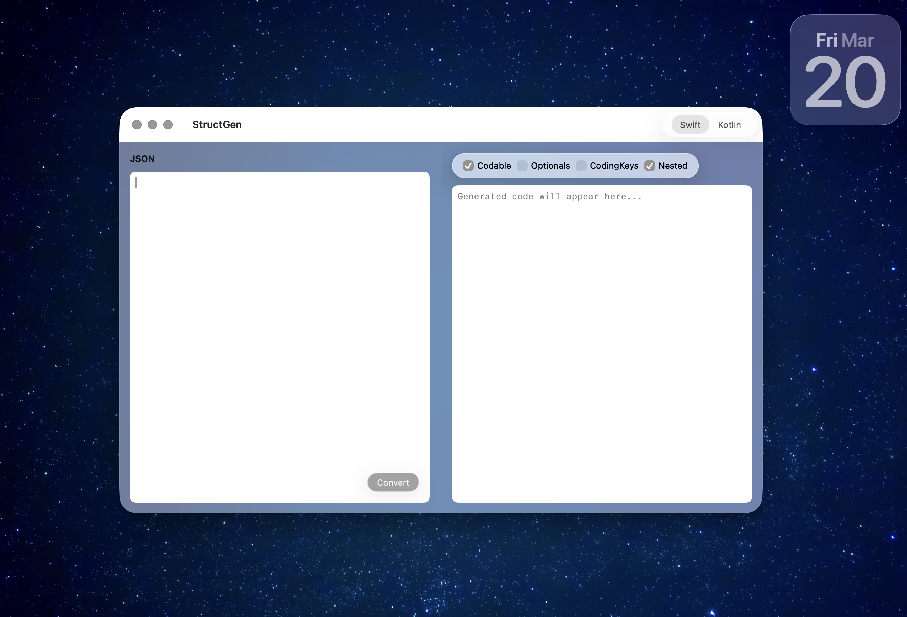
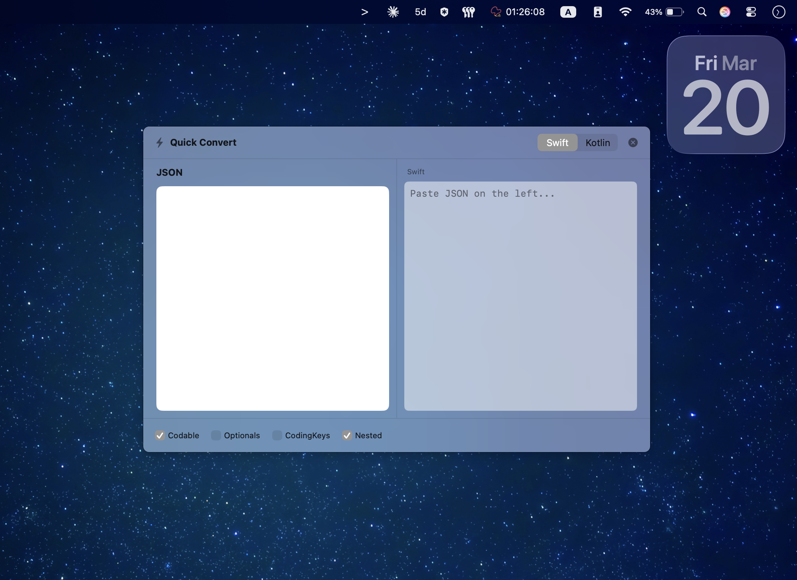

<p align="center">
  
</p>

<h1 align="center">StructGen</h1>

<p align="center">
  A native macOS app that converts JSON objects into Swift (and Kotlin) struct code — instantly.
</p>

<p align="center">
  
  
  
</p>

---

## Preview

<p align="center">
  
</p>

<p align="center">
  
</p>

---

## Features

- **JSON → Swift / Kotlin** — Paste any JSON object and get type-safe struct code generated instantly
- **Smart Type Inference** — Correctly maps `String`, `Int`, `Double`, `Bool`, arrays, nested objects, and `null` → optionals
- **Configurable Output** — Toggle switches for:
  - `Codable` / `@Serializable` conformance
  - Optional vs non-optional properties
  - `CodingKeys` / `@SerializedName` generation (auto snake_case → camelCase)
  - Nested vs flat struct output
- **Syntax Highlighted Output** — Color-coded Swift/Kotlin code with light & dark mode support
- **Auto-Indent JSON** — Formats and indents your JSON as you type
- **Quick Convert Panel** — Press `⌘⇧G` from anywhere (even other apps) to open a floating convert panel
- **Singularized Naming** — Array properties like `orders` generate an `Order` struct, not `Orders`
- **Depth-Ordered Output** — Parent structs always appear before the child structs they reference
- **One-Click Copy** — Copy generated code to clipboard instantly

---

## Folder Structure

```
StructGen/
├── StructGenApp.swift                          # App entry point & window config
├── AppDelegate.swift                           # Global hotkey registration
│
├── Models/
│   ├── GeneratorOptions.swift                  # Toggle states (Codable, optionals, etc.)
│   └── OutputLanguage.swift                    # Swift / Kotlin enum
│
├── Services/
│   ├── StructGenerator.swift                   # JSON parsing & code generation engine
│   ├── SyntaxHighlighter.swift                 # Syntax coloring for output
│   └── GlobalHotkeyManager.swift               # System-wide ⌘⇧G hotkey (Carbon API)
│
├── Helpers/
│   ├── GlassEffectModifier.swift               # Glass material view modifier
│   └── VisualEffectBackground.swift            # NSVisualEffectView wrapper
│
├── Scenes/
│   ├── CommanViews/
│   │   └── JSONTextEditor.swift                # NSTextView-based JSON editor
│   ├── MainApp/
│   │   ├── MainWindowView.swift                # Main split-view window
│   │   └── SubViews/
│   │       ├── GenratedCodeView.swift          # Swift/Kotlin output pane
│   │       └── JsonFiledView.swift             # JSON input pane
│   ├── MenuBarView/
│   │   └── MenuBarController.swift             # Menu bar integration
│   └── QuickActionView/
│       ├── WindowView/
│       │   ├── QuickActionView.swift           # Quick Convert floating panel
│       │   └── SubViews/
│       │       ├── GenratedCodeQuickActionView.swift
│       │       └── OptionsQuickActionView.swift
│       └── AppKitPanel/
│           └── KeyablePanel.swift              # NSPanel for keyboard input
│
└── Assets.xcassets/                            # App icon & accent color
```

---

## Requirements

- macOS 15.0+
- Xcode 16.0+

---

## Installation

1. Clone the repository:
   ```bash
   git clone https://github.com/EngOmarElsayed/StructGen.git
   ```
2. Open `StructGen.xcodeproj` in Xcode
3. Build and run (`⌘R`)

---

## Collaboration

Contributions are welcome! Here's how you can help:

1. **Fork** the repository
2. **Create a feature branch** (`git checkout -b feature/amazing-feature`)
3. **Commit your changes** (`git commit -m 'Add amazing feature'`)
4. **Push to the branch** (`git push origin feature/amazing-feature`)
5. **Open a Pull Request**

### Ideas for Contribution

- Support for more output languages (TypeScript, Dart, Python dataclasses)
- URL and Date type detection from string values
- Custom struct name for the root object
- Export generated code as a `.swift` file
- Drag & drop JSON files onto the window

If you have a bug report or feature request, please [open an issue](https://github.com/EngOmarElsayed/StructGen/issues).

---

## License

This project is licensed under the MIT License — see the [LICENSE](LICENSE) file for details.
